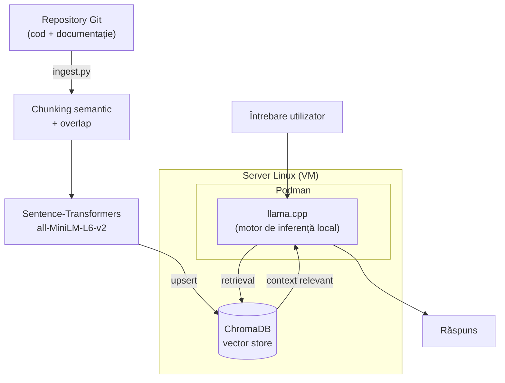

# Local AI Inference Stack — RAG Pipeline

Stack complet de inferență AI on-premise, construit pentru a transforma o mașină virtuală Linux standard într-un server AI capabil să indexeze un repository de cod, să răspundă la întrebări pe baza lui (RAG — Retrieval-Augmented Generation) și să evalueze automat calitatea retrieval-ului la fiecare build, printr-un pipeline CI/CD.

## De ce acest proiect

Acest proiect a pornit de la un repository propriu de **data warehouse pentru analiza piețelor financiare** — modele de date, pipeline-uri ETL, scripturi SQL de transformare, documentație de business logic și decizii de arhitectură acumulate în timp. Pe măsură ce un astfel de proiect crește, informația relevantă devine tot mai greu de găsit.

Un chat de tip RAG peste acest repository rezolvă exact această problemă: transformă documentația și codul dispersat într-o bază de cunoștințe interogabilă în limbaj natural, fără a fi nevoie să cauți manual prin zeci de fișiere. Fiind vorba despre date financiare, cerința suplimentară a fost ca totul să ruleze **on-premise**, pe hardware propriu — fără a trimite cod sau documentație sensibilă către servicii cloud externe. De aici și alegerile din acest stack: motor de inferență local (llama.cpp), containerizare izolată (Podman) și un pipeline CI/CD care garantează, la fiecare modificare a repo-ului, că indexarea rămâne la zi și că retrieval-ul continuă să răspundă corect, oferă răspunsuri de încredere pe baza acestui data warehouse.

## Arhitectură



> Pipeline-ul Jenkins (re-indexare + evaluare + quality gate) rulează separat, peste aceeași infrastructură, și este descris în detaliu în secțiunea [Cum funcționează pipeline-ul](#cum-funcționează-pipeline-ul).

## Tehnologii folosite

| Componentă | Tehnologie | Rol |
|---|---|---|
| Sistem de operare | Linux | Bază pentru serverul AI |
| Containerizare | Podman | Rulare izolată, fără daemon, a serviciilor |
| Motor de inferență | llama.cpp | Servește modelul LLM local, optimizat pentru CPU |
| Vector store | ChromaDB | Stochează și interoghează embeddings |
| Embeddings | sentence-transformers (`all-MiniLM-L6-v2`) | Transformă text în vectori semantici |
| CI/CD | Jenkins | Automatizează re-indexare + evaluare + quality gate |
| Versionare | Git | Sursă pentru documente indexate + istoric commit-uri |

## Cum funcționează pipeline-ul

1. **Checkout** — Jenkins clonează codul din repository.
2. **Setup Environment** — se creează un `venv` Python și se instalează dependențele (`torch` CPU-only, `chromadb`, `sentence-transformers`).
3. **Re-index** (`ingest.py`) — parcurge repository-ul, filtrează fișierele relevante (`.py`, `.java`, `.md`, `.sql`, `.yml` etc.), le împarte în bucăți semantice (chunking cu overlap), generează embeddings și le trimite (`upsert`) în ChromaDB, cu metadate complete (cale fișier, commit SHA, branch, build number).
4. **Evaluation** (`run_eval.py`) — rulează un set fix de întrebări din `golden_set.json` (cu surse și cuvinte-cheie așteptate), interoghează ChromaDB, aplică un rerank lexical + intent-aware peste rezultate, și calculează trei metrici:
   - `source_hit_rate` — % întrebări pentru care sursa corectă e regăsită
   - `answer_keyword_recall` — % cuvinte-cheie relevante găsite în contextul regăsit
   - `empty_context_rate` — % întrebări fără niciun context regăsit
5. **Quality Gate** — compară metricile din `eval/results.json` cu pragurile minime configurate (`MIN_SOURCE_HIT`, `MIN_KEYWORD_RECALL`, `MAX_EMPTY_CONTEXT`). Dacă vreun prag nu e atins, build-ul eșuează — nu se permit regresii silențioase de calitate.
6. **Post: archiveArtifacts** — `eval/results.json` este arhivat la fiecare rulare, pentru trasabilitate și debugging.

## Structura repository-ului

```
.
├── Jenkinsfile              # pipeline CI/CD complet
├── ingestion/
│   └── ingest.py            # indexare cod/documente în ChromaDB
├── eval/
│   ├── run_eval.py          # evaluare automată, folosit de pipeline
│   ├── golden_set.json      # set de întrebări + surse + cuvinte-cheie așteptate
│   └── results.json         # generat automat la fiecare rulare
└── README.md
```

## Rulare locală

```bash
# 1. Mediu virtual
python3 -m venv .venv
source .venv/bin/activate
pip install --upgrade pip
pip install torch --index-url https://download.pytorch.org/whl/cpu
pip install chromadb sentence-transformers requests

# 2. Indexare repository
python ingestion/ingest.py

# 3. Evaluare calitate retrieval
python eval/run_eval.py
```

> Necesită o instanță ChromaDB pornită și accesibilă (implicit configurată pe `10.0.2.2:8000`).

## Metrici de calitate (quality gate)

| Metrică | Prag minim | Descriere |
|---|---|---|
| `source_hit_rate` | 0.70 | Procent întrebări cu sursa corectă regăsită |
| `answer_keyword_recall` | 0.78 | Procent cuvinte-cheie relevante regăsite în context |
| `empty_context_rate` | ≤ 0.10 | Procent maxim acceptat de întrebări fără context regăsit |

## Provocări întâmpinate

- **Modelul de embedding** ales (`all-MiniLM-L6-v2`), fiind rapid și potrivit pentru CPU, nu distinge suficient de bine concepte similare lexical dar diferite semantic (ex. cod Java vs. Python) — rezolvat printr-un rerank hibrid, care combină similaritatea vectorială cu semnale lexicale și de intenție a întrebării.
- **Continuitatea informației la granițele dintre chunk-uri** — rezolvată prin overlap configurabil între bucăți de text consecutive.
- **Idempotența re-indexării** — rezolvată prin ID-uri deterministe (hash pe cale + index chunk) și `upsert` în loc de `insert`, astfel încât rulările repetate ale pipeline-ului să nu producă duplicate.

## Posibile îmbunătățiri viitoare

- Extinderea `golden_set.json` cu mai multe exemple, pentru metrici mai stabile statistic.
- Generalizarea expansiunii de query, în prezent parțial specifică proiectului indexat.
